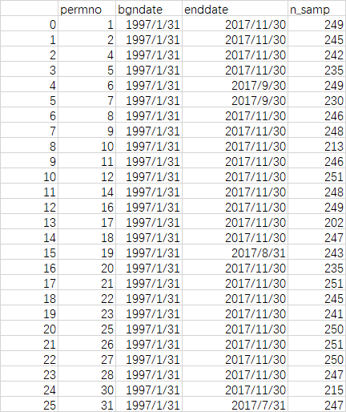
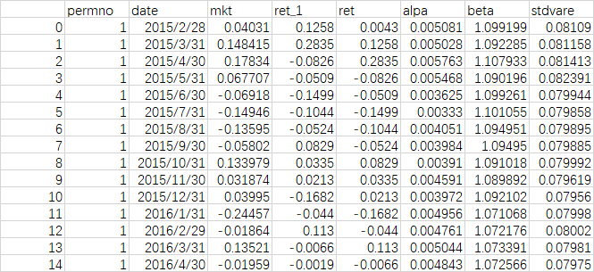
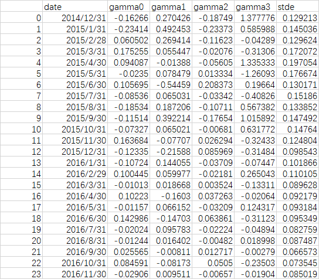
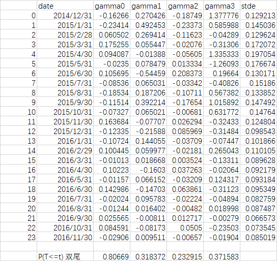

# 1.文件说明
## 1.1. 程序文件
### docoding.py
程序文件执行了从数据读取至输出的绝大部分工作。
## 1.2. 输出结果
### sf_info.csv 
报告了所有上市公司数据起始时间和终止时间。 

### alldata.csv 
报告了所有上市公司自2014年12月31日至2016年11月30日的第一步回归结果，由于部分公司缺失了部分数据，
而beta计算是根据2005年1月起120个月的数据进行滚动回归进行的，因此部分公司起始时间晚于2014年12月。
 
 
### result.csv
报告了第二步回归结果。第二部回归共24次，为2014年12月31日至2016年11月30日共24个月的回归结果，
其中gamma0为回归的常数项，gamma1为β一次项系数，gamma2位β二次项系数，gamma3为残差标准差的系数
stde为第二步回归残差标准差。 

### result.xlsx
由result.csv直接转化而来，用excel数据分析t检验进行了检验，检验p值列在结果下方。

### mkt.csv
市场收益率输入文件

### msf.csv
个股收益率输入文件

# 2. 结果分析
根据最终结果result.csv显示，gamma1-gamma3各项的p值均大于0.2，即不能拒绝其为0的原假设。因此CAPM模型在A股市场并不成立。
 
